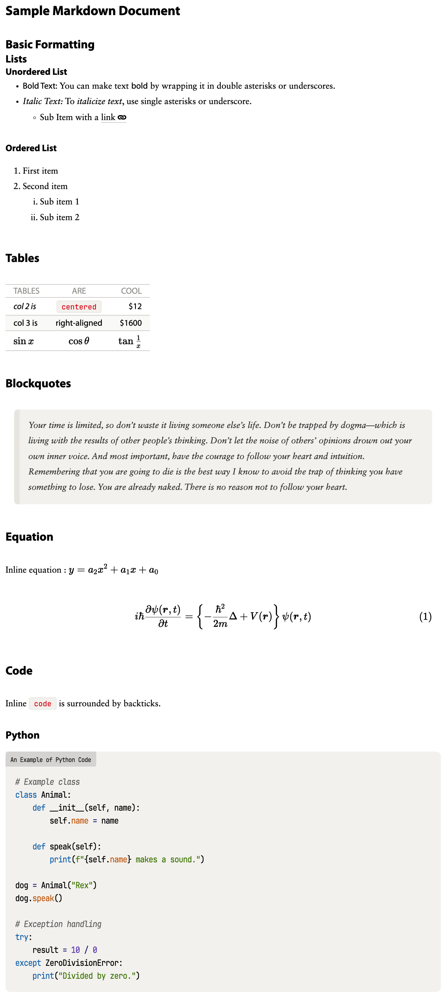

# Modern Type Preview Theme for Inkdrop
Where Clarity Meets Elegance in Markdown Editing


# Introduction

The Modern Type Theme prioritizes clarity and ease of reading, making it perfect for both long hours of writing and quick note-taking.

## Screenshots


**Light Theme**


**Dark Theme**

## Details

|||
|---|---|
|Light Theme|Dark Theme|


# Notes

This preview theme uses various fonts from Google Fonts by default. If you are dissatisfied with this behavior, it could be overwritten by the `styles.less` file using the CSS Variables:

```
:root {
  --inkdrop-header-font: sans-serif;
  --inkdrop-body-font: serif;
  --inkdrop-alt-font: sans-serif;
  --inkdrop-code-font: monospace;
}
```

| Settings                | Where Used             |
| ----------------------- | ---------------------- |
| `--inkdrop-header-font` | Headings               |
| `--inkdrop-alt-font`    | strong, dt, dl, th, td |
| `--inkdrop-code-font`   | Inline/Block for Code  |
| `--inkdrop-body-font`   | Everything else        |
